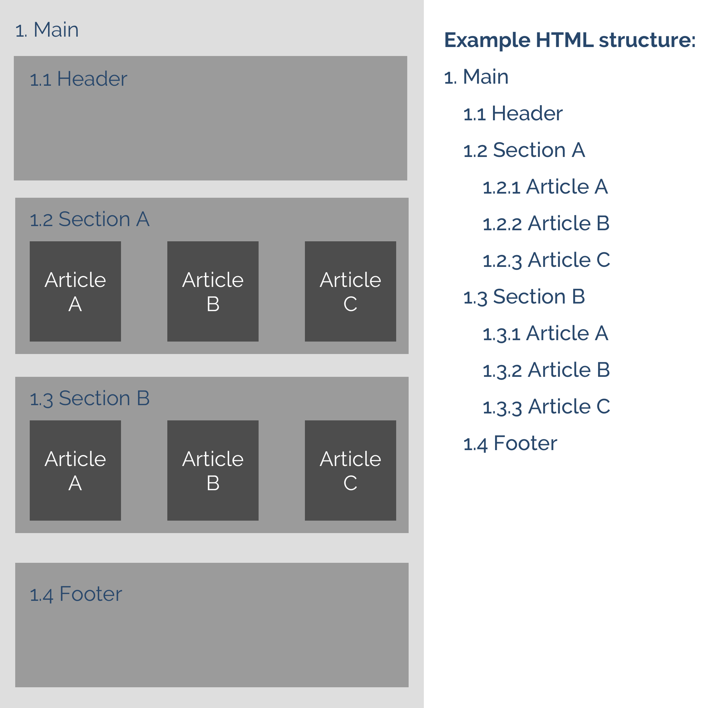
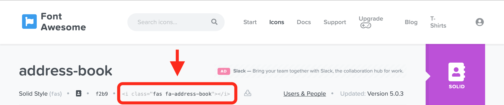
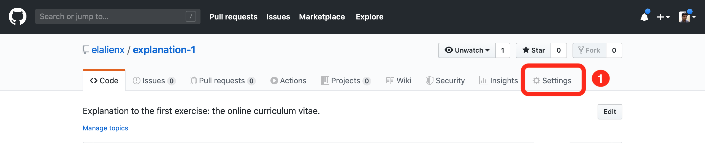
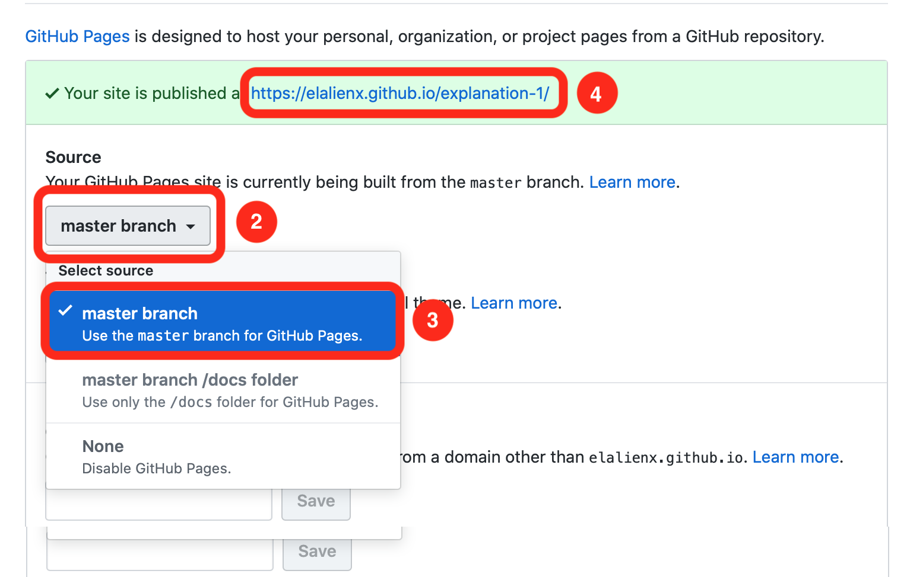

# HTML Introduction
This web starter template is based on pure HTML 5, CSS 3.0 to create an online curriculum vitae that you can share online with prospective recruiters. In addition, with will publish to a web server using GitHub pages and use Tiny URL to personalize a URL. Check the following links for documentation and guides:
- [HTML 5](https://www.w3schools.com/html/html5_intro.asp)
- [CSS 3.0](https://www.w3schools.com/css/)
- [Bootstrap](https://getbootstrap.com)

Extra elements 1:
- [Google Fonts](https://fonts.google.com)
- [Font awesome icons](https://fontawesome.com)

Extra elements 2:
- [GitHub pages hosting](https://pages.github.com)
- [Tiny URL](https://tiny.cc)

Tip: Use CMD + click on Mac or Ctrl + click on Windows to open link in a new browser tab.

## Setup
Our project is a front-development single-page document that consists of three parts:
1. The markup file (index.html)
2. The column layout (Bootstrap grid)
3. Personalizing style (style.css)

### Pre-requisites
- Check the result example.
- Install VS Code or any other JavaScript-friendly IDE.

### Example result
Visit the website [Eduardo Alvarez Curriculum Vitae](http://tiny.cc/eduardo-cv). Analyze the structure: introduction, work experience, education, and contact information. Think about what sections do you need and what additional content can you include to improve it.

### Install VS Code
Visit the website [VSCode](https://code.visualstudio.com) and download the installer using the button with the label "Stable build". Then proceed with the installation.

### Main task
#### Writing the markup information
1. Use the tag `<main>` to contain your whole project. The equivalent of an entire physical book.
2. Use the tag `<head>` for your introduction part. The equivalent of the cover of a book.
3. Use the tag `<section>` to specify a complete section that can stand on their own. This is the equivalent of an entire book chapter.
4. Use the tag `<article>` to specify a small part piece of text or content. The equivalent of a page on your book.
5. Use the tag `<footer>` to specify the last part of your page. The equivalent of the back cover of a book.

*Figure 1: HTML reference structure*

#### Adding the basic column grid
Bootstrap is a CSS framework that allows you to quickly add a layout structure and style to your webpages and web projects. We will use Bootstrap to generate the 3 column layout.
1. Copy the CDN link of Bootstrap on the head of your file.
2. Read about the column CSS classes row and column ("col-sm") on the documentation to make the 3 column layout.
3. Double-check that works both on desktop and mobile (to quickly simulate a mobile device just narrow your browser window)

#### Personalizing
We can further personalize the project by applying some basic CSS properties to your HTML tags. To do so, follow these steps:
1. Create a new folder called "css".
2. Create a file called "style.css" inside the previous folder.
3. Create a link tag on your project head that points to that style.

### Extra task 1: Additional personalization
This optional task will allow you to increase the appeal of your CV by adding small touches like custom fonts and icons, increasing the chances of a recruiter reading it from the beginning to the end.

#### Adding fonts
Go to [Google Fonts](https://fonts.google.com), look for a typography that you like (this example uses Gothic A1) and then follow these steps:
1. Press the red circle with a "+" sign to add to the download list.
2. Press the black bar with the text "Family Selected".
3. Copy the HTML link tag that appears below the subtitle "Embed Font".
4. Paste the link tag at the end of your head tag inside your web file.
5. Copy the CSS code that appears below the subtitle "Specify in CSS".
6. Paste the code on the body tag in your CSS file.

#### Adding icons
Go to [Font awesome icons](https://fontawesome.com) to browse for icons that you want to add and then follow these steps:
1. Add this script to the head tag of your page: 
2. Copy the tag of the icon you want to use (check the image below for reference)
3. Paste the HTML tag inside your document.
4. Don't forget to add a margin-right or bottom to avoid having the icon to close to any other element.

*Figure 2: Where to find the icon tag on Font Awesome*

### Extra task 2: Publish on the internet
This optional tasks will allow you to publish your content on the internet, ready to share with anybody. To do so, you need a server that stores your files and a URL that people can write to locate your website.

#### Publish on GitHub pages
Do you know that you can use your Git repository to show simple webpages? In this extra step, we will do just that. To publish your CV follow these steps:
1. On your GitHub git repository, click on settings.
2. Scroll down until you find the section "GitHub Pages" and click on the source
3. Select your master branch.
4. Click on the green bar with the link that appeared just above this section.

*Figure 3: GitHub pages step 1*

---

*Figure 4: GitHub pages steps 2 to 4*

#### Adding a URL shortener for easy sharing
This guide will not cover how to purchase or configure a domain name like [eduardoalvarez.com](http://www.eduardoalvarez.com), but at least will teach a quick workaround to have a personalized link to share with friends and potential employers.

With your CV published on GitHub Pages, follow these steps:
1. Go to [Tiny URL](https://tiny.cc). 
2. Pasted the link where the "Paste a Long URL" text appears.
3. Write your name and surname where the "Custom" text appears.
4. Press the "Shorten" button.